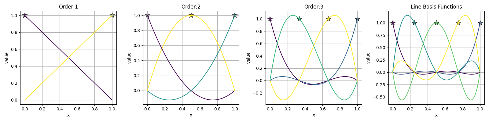

Basis
=====

1D Line Basis 
-------------

.. code-block:: python

    from tensormesh.element import Line
    from tensormesh.element.plot import plot_1d

    fig, axes = plt.subplots(ncols=4, figsize=(16,4))

    for i, order in enumerate(range(1,5)):
        basis = Line.get_basis(order)
        basis_fns = Line.get_basis_fns(order)
        plot_1d(basis, basis_fns, ax=axes[i], legend=False)
        axes[i].set_title(f"Order:{order}")

2D Triangle Basis 
-----------------

.. code-block:: python

    from tensormesh.element import Triangle
    import matplotlib.pyplot as plt 

    fig = plt.figure((16,4))
    for basis in range(1, 5):
        ax = fig.add_subplot(1, 4, order)
        basis = Triangle.get_basis(order)
        for i in range(n_basis):
            ax.scatter(basis[i, 0], basis[i, 1], s=scatter_size)
            ax.text(basis[i, 0], basis[i, 1], f'{i+1}', fontsize=font_size)
        ax.set_xlabel('x')
        ax.set_ylabel('y')
        ax.grid(True)
    
        # Draw element edges
        edges = element.points[element.edge]
        for edge in edges:
            ax.plot(edge[:, 0], edge[:, 1], 'k-', alpha=0.5)

2D Quadrilateral Basis 
----------------------

.. code-block:: python

    from tensormesh.element import Quadrilateral
    import matplotlib.pyplot as plt 

    fig = plt.figure((16,4))
    for basis in range(1, 5):
        ax = fig.add_subplot(1, 4, order)
        basis = Quadrilateral.get_basis(order)
        for i in range(n_basis):
            ax.scatter(basis[i, 0], basis[i, 1], s=scatter_size)
            ax.text(basis[i, 0], basis[i, 1], f'{i+1}', fontsize=font_size)
        ax.set_xlabel('x')
        ax.set_ylabel('y')
        ax.grid(True)
    
        # Draw element edges
        edges = element.points[element.edge]
        for edge in edges:
            ax.plot(edge[:, 0], edge[:, 1], 'k-', alpha=0.5)

3D Tetrahedron Basis 
--------------------

.. code-block:: python

    from tensormesh.element import Tetrahedron
    import matplotlib.pyplot as plt 

    order = 3
    basis = Tetrahedron.get_basis(order)
    fax = fig.add_subplot(1, 4, order, projection='3d')
    for i in range(n_basis):
        ax.scatter(basis[i, 0], basis[i, 1], basis[i, 2], s=scatter_size)
        ax.text(basis[i, 0], basis[i, 1], basis[i, 2], f'{i+1}', fontsize=font_size)
    ax.set_xlabel('x')
    ax.set_ylabel('y')
    ax.set_zlabel('z')
    
    # Draw element edges
    edges = element.points[element.edge]
    for edge in edges:
        ax.plot(edge[:, 0].numpy(), edge[:, 1].numpy(), edge[:, 2].numpy(), 'k-', alpha=0.5)

.. raw:: html

    

        <iframe src="../_static/plot_basis/tetra.html" width="600px" height="500px"></iframe>
    

3D Hexahedron Basis 
-------------------

.. code-block:: python

    from tensormesh.element import Hexahedron
    import matplotlib.pyplot as plt 

    order = 3
    basis = Hexahedron.get_basis(order)
    fax = fig.add_subplot(1, 4, order, projection='3d')
    for i in range(n_basis):
        ax.scatter(basis[i, 0], basis[i, 1], basis[i, 2], s=scatter_size)
        ax.text(basis[i, 0], basis[i, 1], basis[i, 2], f'{i+1}', fontsize=font_size)
    ax.set_xlabel('x')
    ax.set_ylabel('y')
    ax.set_zlabel('z')
    
    # Draw element edges
    edges = element.points[element.edge]
    for edge in edges:
        ax.plot(edge[:, 0].numpy(), edge[:, 1].numpy(), edge[:, 2].numpy(), 'k-', alpha=0.5)

.. raw:: html

    

        <iframe src="../_static/plot_basis/hex.html" width="600px" height="500px"></iframe>
    

3D Pyramid Basis 
----------------

.. code-block:: python

    from tensormesh.element import Pyramid
    import matplotlib.pyplot as plt 

    order = 3
    basis = Pyramid.get_basis(order)
    fax = fig.add_subplot(1, 4, order, projection='3d')
    for i in range(n_basis):
        ax.scatter(basis[i, 0], basis[i, 1], basis[i, 2], s=scatter_size)
        ax.text(basis[i, 0], basis[i, 1], basis[i, 2], f'{i+1}', fontsize=font_size)
    ax.set_xlabel('x')
    ax.set_ylabel('y')
    ax.set_zlabel('z')
    
    # Draw element edges
    edges = element.points[element.edge]
    for edge in edges:
        ax.plot(edge[:, 0].numpy(), edge[:, 1].numpy(), edge[:, 2].numpy(), 'k-', alpha=0.5)

.. raw:: html

    

        <iframe src="../_static/plot_basis/pyr.html" width="600px" height="500px"></iframe>
    

3D Prism Basis 
--------------

.. code-block:: python

    from tensormesh.element import Prism
    import matplotlib.pyplot as plt 

    order = 3
    basis = Prism.get_basis(order)
    fax = fig.add_subplot(1, 4, order, projection='3d')
    for i in range(n_basis):
        ax.scatter(basis[i, 0], basis[i, 1], basis[i, 2], s=scatter_size)
        ax.text(basis[i, 0], basis[i, 1], basis[i, 2], f'{i+1}', fontsize=font_size)
    ax.set_xlabel('x')
    ax.set_ylabel('y')
    ax.set_zlabel('z')
    
    # Draw element edges
    edges = element.points[element.edge]
    for edge in edges:
        ax.plot(edge[:, 0].numpy(), edge[:, 1].numpy(), edge[:, 2].numpy(), 'k-', alpha=0.5)

.. raw:: html

    

        <iframe src="../_static/plot_basis/pri.html" width="600px" height="500px"></iframe>
    
