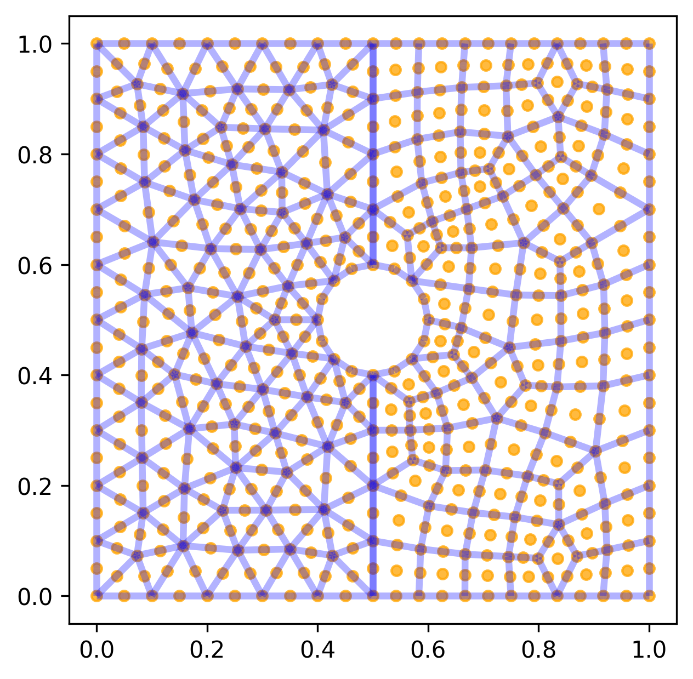

Mesh Generation
===============

2D high order mesh 
------------------

.. code-block:: python

    import matplotlib.pyplot as plt
    from tensormesh import mesh,MeshGen
    import tensormesh as tm
    import tensormesh.visualization as V

    fig, axes = plt.subplots(figsize=(12, 6), ncols=2)
    for ele, ax in zip(["tri","quad"], axes):
        mesh_gen = tm.MeshGen(element_type=None, chara_length=0.5, order=4)
        mesh_gen.add_rectangle(0, 0, 1, 1, element=ele)
        mesh_gen.gen().plot(ax=ax)
    axes[0].set_title("Triangle Mesh")
    axes[1].set_title("Quadrilateral Mesh")

2D high circle mesh 
-------------------

.. code-block:: python

    mesh_gen = tm.MeshGen(element_type=None, chara_length=0.1, order=2)
    mesh_gen.add_circle(0.5, 0.5, 0.4, element="tri")
    ax = mesh_gen.gen().plot(save_path="output/circle_mesh.png")

2D hybrid mesh
--------------

.. code-block:: python

    mesh_gen:tm.Mesh = tm.MeshGen(element_type=None, chara_length=0.1, order=2)
    mesh_gen.add_rectangle(0,0,0.5,1, element="tri")
    mesh_gen.add_rectangle(0.5,0,0.5,1, element="quad")
    mesh_gen.remove_circle(0.5,0.5,0.1)
    ax = mesh_gen.gen().plot(save_path="output/hybrid_mesh2d.png")

3D high order mesh 
------------------

.. code-block:: python

    import matplotlib.pyplot as plt
    from tensormesh import mesh,MeshGen
    import tensormesh as tm
    import tensormesh.visualization as V
    
    fig, axes = plt.subplots(figsize=(12, 6), ncols=2)
    for i, (ele, order, ax) in enumerate(zip(["tet", "hex"], [3,2], axes)):
        mesh_gen = tm.MeshGen(element_type=None, dimension=3, chara_length=0.9, order=order)
        mesh_gen.add_cube(0, 0, 0, 1, 1, 1, element=ele)
        ax = mesh_gen.gen().plot(ax=ax, draw_basis=False)
        axes[i] = ax
    axes[0].set_title("Tetrahedral Mesh")
    axes[1].set_title("Hexahedral Mesh")

.. raw:: html

    

        <iframe src="../_static/plot_mesh/cube_mesh.html" width="600px" height="500px"></iframe>
    

