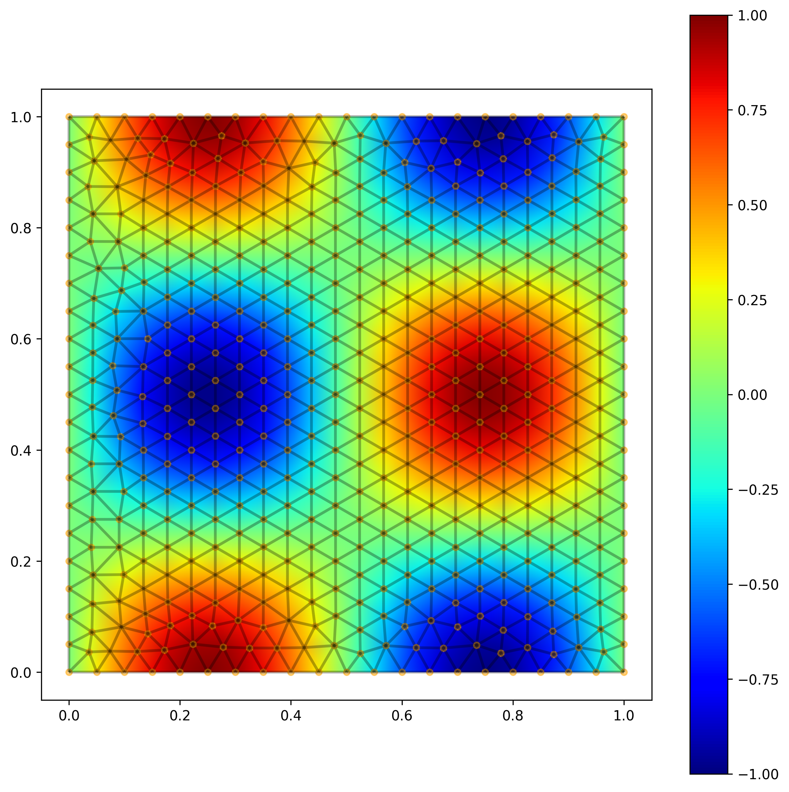
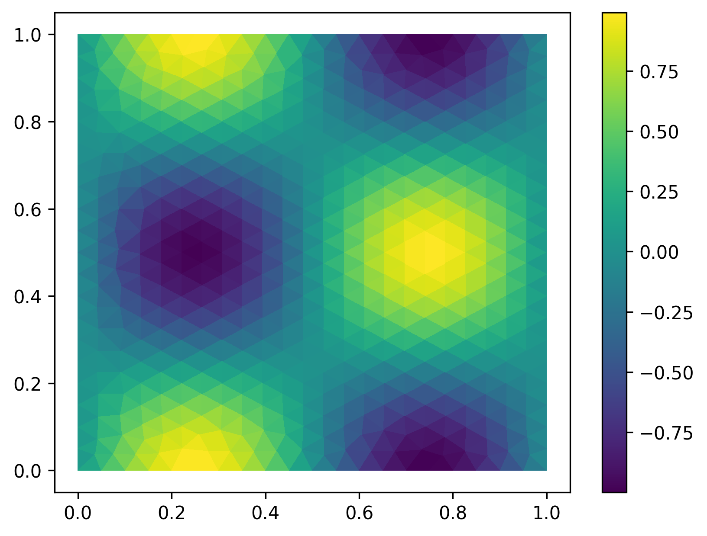

Plot values
===========

2D Point Value 
--------------

.. code-block:: python 

    from tensormesh import mesh,MeshGen
    import tensormesh as tm
    import tensormesh.visualization as V

    GRAPH_ALPHA = 0.5
    GRAPH_COLOR = "lightblue"
    GRAPH_LINEWIDTH = 1 
    MESH_COLOR = "black"
    MESH_LINEWIDTH = 2

    mesh_gen = tm.MeshGen(element_type=None, chara_length=0.05, order=1)
    mesh_gen.add_rectangle(0,0,1,1, element="tri")
    mesh:tm.Mesh = mesh_gen.gen()
    
    # Create some sample point values
    points = mesh.points
    point_values = torch.sin(2*np.pi*points[:,0]) * torch.cos(2*np.pi*points[:,1])
    
    # Plot using interpolation
    img, ax = V.draw_point_value(mesh, point_values)
    fig = ax.get_figure()
    fig.colorbar(img)
    mesh.plot(ax = ax, edgecolor=MESH_COLOR, linewidth=MESH_LINEWIDTH)
   

2D Element Value 
----------------

.. code-block:: python 

    from tensormesh import mesh,MeshGen
    import tensormesh as tm
    import tensormesh.visualization as V

    GRAPH_ALPHA = 0.5
    GRAPH_COLOR = "lightblue"
    GRAPH_LINEWIDTH = 1 
    MESH_COLOR = "black"
    MESH_LINEWIDTH = 2

    mesh_gen = tm.MeshGen(element_type=None, chara_length=0.3, order=1, dimension=3)
    mesh_gen.add_cube(0,0,0,1,1,1, element="tet")
    mesh:tm.Mesh = mesh_gen.gen()
    # Create some sample point values
    points = mesh.points
    point_values = torch.sin(2*np.pi*points[:,0]) * torch.cos(2*np.pi*points[:,1]) * torch.sin(2*np.pi*points[:,2])
    
    # Plot using interpolation
    img, ax = V.draw_point_value(mesh, point_values)
    fig = ax.get_figure()
    fig.colorbar(img)
    mesh.plot(ax = ax, edgecolor=MESH_COLOR, linewidth=MESH_LINEWIDTH)
    

3D Point Value 
--------------

.. code-block:: python 

    from tensormesh import mesh,MeshGen
    import tensormesh as tm
    import tensormesh.visualization as V

    GRAPH_ALPHA = 0.5
    GRAPH_COLOR = "lightblue"
    GRAPH_LINEWIDTH = 1 
    MESH_COLOR = "black"
    MESH_LINEWIDTH = 2

    mesh_gen = tm.MeshGen(element_type=None, chara_length=0.05, order=1)
    mesh_gen.add_rectangle(0,0,1,1, element="tri")
    mesh:tm.Mesh = mesh_gen.gen()
    
    # Create some sample element values
    elements = mesh.elements(mesh.dim)
    element_values = {"triangle": torch.sin(2*np.pi*mesh.points[elements["triangle"]].mean(1)[:,0]) * 
                           torch.cos(2*np.pi*mesh.points[elements["triangle"]].mean(1)[:,1])}
    
    # Plot using interpolation
    collections, ax = V.draw_element_value(mesh, element_values)
    fig = ax.get_figure()

.. raw:: html

    

        <iframe src="../_static/plot_mesh/point_value_3d.html" width="600px" height="500px"></iframe>
    

3D Element Value 
----------------

.. code-block:: python 

    from tensormesh import mesh,MeshGen
    import tensormesh as tm
    import tensormesh.visualization as V

    GRAPH_ALPHA = 0.5
    GRAPH_COLOR = "lightblue"
    GRAPH_LINEWIDTH = 1 
    MESH_COLOR = "black"
    MESH_LINEWIDTH = 2

    mesh_gen = tm.MeshGen(element_type=None, chara_length=0.3, order=1, dimension=3)
    mesh_gen.add_cube(0,0,0,1,1,1, element="tet")
    mesh:tm.Mesh = mesh_gen.gen()
    
    # Create some sample element values
    elements = mesh.elements(mesh.dim)
    centroids = mesh.points[elements["tetra"]].mean(1)
    element_values = {"tetra": torch.sin(2*np.pi*centroids[:,0]) * 
                           torch.cos(2*np.pi*centroids[:,1]) *
                           torch.sin(2*np.pi*centroids[:,2])}
    
    # Plot using interpolation
    collections, ax = V.draw_element_value(mesh, element_values)

.. raw:: html

    

        <iframe src="../_static/plot_mesh/ele_value_3d.html" width="600px" height="500px"></iframe>
    
